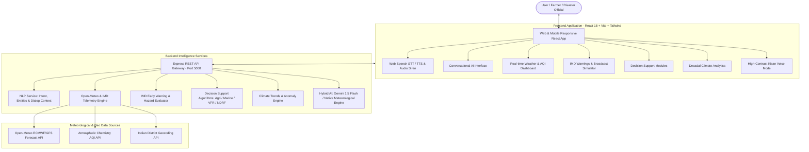

# 🌤️ MausamVani AI (मौसमवाणी / మౌసమ్‌వాణి)
### Conversational AI Platform for Weather Forecasting, Alerts, and Climate Intelligence

> **Problem Statement for a Hackathon**: Conversational AI for Weather Forecasting, Alerts, and Climate Information.  
> An intelligent, scalable, and multilingual platform providing accurate, contextual weather information, early warnings, and domain-specific decision support across Indian languages through text and voice.

---

## 🌟 Executive Summary

**MausamVani AI** solves the fragmentation of meteorological intelligence across scattered bulletins and satellite portals by delivering an intelligent conversational system accessible to farmers, fishermen, disaster responders, aviation operators, and the general public.

- **Unified Intelligence**: Gathers live telemetry from global WMO models and IMD (India Meteorological Department) grids via Open-Meteo.
- **Multilingual & Voice-First**: Natural voice and text interactions in **English, Hindi (हिन्दी), Telugu (తెలుగు), Tamil (தமிழ்)**, Kannada, Bengali, and Marathi.
- **Domain Decision Support System (DSS)**: Real-time decision matrices for Agriculture, Marine & Fisheries, Aviation, Disaster Management, and Public Health.
- **IMD Color-Coded Early Warnings**: Automatic detection of Red, Orange, Yellow, and Green alerts with simulated SMS/WhatsApp emergency broadcast and audio siren.
- **Climate Analytics & Decadal Trends**: 30-year historical climate records (1995-2026), temperature anomalies, monsoon departure trends, and vulnerability matrices.
- **Hybrid AI Architecture**: Seamlessly leverages Google Gemini 1.5 Flash when an API key is provided, while guaranteeing 100% offline/out-of-the-box reliability with our specialized Native Meteorological Expert Engine.

---

## 🏗️ System Architecture



---

## ⚙️ Core Modules & Features

### 1. 💬 Conversational AI Interface
- **Natural Language Understanding**: Understands queries regarding rainfall, temperature, cyclone tracks, spraying feasibility, irrigation schedules, etc.
- **Multi-Turn Context Retention**: Maintains state across follow-ups (e.g., *"Will it rain in Hyderabad?"* $\to$ *"What about tomorrow?"* $\to$ *"Is it safe to spray pesticides?"*).
- **Embedded Meteorological Badges**: Live temperature, feels-like, wind speed, humidity, rain chance, and AQI chips directly inside conversational answers.
- **Contextual Suggested Chips**: Dynamically generates follow-up question pills in the user's selected language.

### 2. 🎙️ Voice Accessibility (Rural Focus / Kisan Mode)
- **Speech-to-Text (STT)**: Direct voice queries using browser `SpeechRecognition` tuned for Indian accents (`en-IN`, `hi-IN`, `te-IN`, `ta-IN`).
- **Text-to-Speech (TTS)**: Spoken audio read-out of responses with native pitch and cadence.
- **Kisan Simplified Mode**: High-contrast, large-button interface designed for rural and low-literacy users with 1-tap audio queries:
  - *“ఈరోజు వర్షం పడుతుందా?”* (Will it rain today?)
  - *“పంటకు నీరు పెట్టవచ్చా?”* (Should I irrigate?)
  - *“మందులు చల్లవచ్చా?”* (Can I spray pesticide?)
  - *“చేపల వేటకు వెళ్లవచ్చా?”* (Can fishermen venture out?)

### 3. 🌦️ Real-Time Weather & Air Quality Engine
- **Hyper-Local Geocoding**: Instant search for any Indian city, district, or taluk + one-touch GPS geolocation.
- **Live Atmosphere Metrics**: Temperature, apparent temperature, humidity, surface pressure, cloud cover, UV index.
- **24-Hour Hourly Slider**: Hourly temperature curve, wind speed, and precipitation probability.
- **7-Day Extended Outlook**: Daily highs/lows, rain accumulation (mm), and sunrise/sunset.
- **Air Quality Gauge (AQI)**: Continuous monitoring of US/European AQI, PM2.5, PM10, $\text{NO}_2$, $\text{SO}_2$, and $\text{O}_3$.

### 4. ⚠️ IMD Weather Alerts & Early Warnings
- **IMD Severity Standards**:
  - 🔴 **Red Alert** (Take Action): Extremely heavy rain (>115mm), severe cyclonic storms, extreme heatwaves (>43°C).
  - 🟠 **Orange Alert** (Be Prepared): Very heavy rain (64-115mm), squalls, high sea surge.
  - 🟡 **Yellow Alert** (Be Aware): Scattered thunderstorms, convective rain, mild heatwaves.
  - 🟢 **Green Alert** (No Warning): Normal seasonal conditions.
- **Simulated Emergency Dispatcher**: Test broadcasting multilingual emergency alerts via SMS, WhatsApp, and Push notifications to registered community phone numbers.
- **Cyclone & Sea Surge Radar**: Real-time coordinates, storm surge height, distance to landfall, and port warning flags.
- **Emergency Audio Siren**: Web Audio synthesizer for testing loud warning sirens during Red Alert emergencies.

### 5. 🎯 Multi-Domain Decision Support System (DSS)
1. **🌾 Agriculture (Kisan Mitra)**:
   - Soil moisture deficit estimation & evapotranspiration rate ($\text{mm/day}$).
   - **Irrigation Guidance**: Postpone irrigation if heavy rain is forecast within 48h to prevent root rot and save electricity/water.
   - **Spraying Feasibility**: Calculates wind drift risk and rain wash-off to verify whether chemical spraying is safe.
   - **Crop Management Tips**: Specialized advisories for Paddy (వరి), Cotton (ప్రత్తి), Chilli (మిరప), and seasonal vegetables.
2. **🌊 Marine & Fisheries (Sagar Mitra)**:
   - INCOIS-standard sea venturing status (**Safe to Sail / Caution Advised / Total Sea Ban**).
   - Swell wave height (m), open sea wind in knots, and harbor cautionary flags (Signal No. 1 to 10).
3. **✈️ Aviation & Logistics (Viman Alert)**:
   - Surface runway visibility (RVR), cloud ceiling height, crosswind shear, and flight disruption risk.
4. **🚨 Disaster Management (Aapda Prabandhan)**:
   - Threat severity index (1-10), flood inundation risk, SDRF/NDRF deployment readiness, and emergency contacts directory.
5. **🏙️ Public Health & Urban Planning**:
   - Heat Index / Wet-Bulb Globe Temperature calculations for outdoor workers and stormwater drainage load indices.

### 6. 📈 Climate Analytics & Long-Term Trends
- **30-Year Decadal Records (1995 - 2026)**: Temperature anomalies showing $+1.34^\circ\text{C}$ warming shift against baseline.
- **Monsoon Departure Trends**: Southwest monsoon percentage variation against the $880\text{ mm}$ Long Period Average (LPA).
- **Extreme Weather Frequency Multipliers**: Decadal acceleration in annual heatwave days and severe cyclones.
- **Agro-Climatic Vulnerability Zones**: Vulnerability matrices for Deccan, East Coast, Indo-Gangetic Plains, and Western Ghats.

---

## 🚀 Getting Started

### Prerequisites
- **Node.js** (v18 or higher recommended; tested on v24)
- **npm** (v10 or higher)

### 1. Clone & Install Dependencies
```bash
# Navigate to the project root
cd project

# Install backend dependencies
cd backend
npm install

# Install frontend dependencies
cd ../frontend
npm install
```

### 2. Configure Environment (Optional)
Create `backend/.env` (or copy from `backend/.env.example`):
```env
PORT=5000
# Optional: Provide Google Gemini API Key to enable live Gemini 1.5 Flash generation
# If left blank, the platform uses its built-in Native Meteorological Engine!
GEMINI_API_KEY=
```

### 3. Build & Run
You can run the full-stack application with a single command from the project root:
```bash
# Build the production frontend SPA
npm run build:frontend

# Start the unified full-stack server
npm start
```
Open **`http://localhost:5000`** in your browser.

> For active development with hot-module reloading:
> - Backend: `npm run dev:backend` (runs on `http://localhost:5000`)
> - Frontend: `npm run dev:frontend` (runs on `http://localhost:5173` with proxy to 5000)

---

## 📡 REST API Reference

| Endpoint | Method | Description | Sample Query Parameters / Body |
| :--- | :--- | :--- | :--- |
| `/api/health` | `GET` | Health status and supported features | — |
| `/api/weather` | `GET` | Live weather, hourly, 7-day, & AQI | `?city=Hyderabad` or `?lat=17.38&lon=78.48` |
| `/api/locations/search`| `GET` | Geocoding search for Indian cities | `?q=Vijayawada` |
| `/api/alerts` | `GET` | IMD alerts for location + national feed | `?city=Visakhapatnam` |
| `/api/alerts/dispatch`| `POST`| Simulated emergency broadcast | `{ "alertId": "ALT-001", "channel": "sms", "phone": "+91..." }` |
| `/api/decision-support`| `GET`| Multi-domain operational DSS | `?city=Guntur` |
| `/api/climate` | `GET` | Decadal climate trends & anomalies | `?region=India+National` |
| `/api/chat` | `POST`| Conversational AI query endpoint | `{ "message": "Will it rain tomorrow in Delhi?", "language": "auto" }` |

---

## 🌐 Multilingual Query Examples

- **Telugu (తెలుగు)**:
  - *“రేపు హైదరాబాద్ లో వర్షం పడుతుందా?”* (Will it rain in Hyderabad tomorrow?)
  - *“ఈరోజు వరి పంటకు నీరు పెట్టవచ్చా?”* (Can I irrigate my paddy crop today?)
  - *“తీర ప్రాంతంలో తుఫాను హెచ్చరికలు ఉన్నాయా?”* (Are there cyclone warnings in coastal areas?)
- **Hindi (हिन्दी)**:
  - *“क्या आज दिल्ली में बारिश की संभावना है?”* (Is there rain probability in Delhi today?)
  - *“कीटनाशक और खाद के छिड़काव के लिए मौसम कैसा है?”* (How is the weather for pesticide/fertilizer spraying?)
  - *“क्या आज मछुआरों के लिए समुद्र में जाना सुरक्षित है?”* (Is it safe for fishermen to venture into the sea today?)
- **English**:
  - *“Will it rain in Hyderabad today?”*
  - *“Give me an agricultural advisory for cotton farming in Guntur.”*
  - *“What is the runway visibility and flight risk at Delhi airport?”*

---

## 🛡️ License & Attribution
- Meteorological data provided via **Open-Meteo** (WMO ECMWF/GFS calibrated feeds) and **IMD Bulletins**.
- Built with **React 18**, **Tailwind CSS**, **Lucide Icons**, **Express.js**, and **Google Gemini API**.
- Licensed under the **MIT License**.
